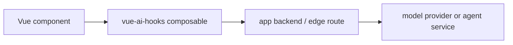

# Choosing vue-ai-hooks

Use this page when deciding whether `vue-ai-hooks` is the right layer for a Vue
AI feature. It compares product fit rather than trying to rank libraries.

## Short answer

Choose `vue-ai-hooks` when you want:

- Vue 3 refs and composables as the primary API.
- Streaming chat, completions, embeddings, structured objects, and custom
  generation jobs in one package.
- App-owned proxy routes by default for browser production safety.
- Direct provider helpers for local demos, prototypes, and restricted keys.
- Tool calls, tool approvals, stream data, retries, persistence, and request
  inspection without adding a full agent framework.

Pick another layer when you need a full-stack React-first SDK, a provider SDK for
server-only calls, or a multi-agent orchestration framework.

## Decision table

| If your job is...                                     | Start with                                      |
| ----------------------------------------------------- | ----------------------------------------------- |
| Build a Vue chat UI with streaming state              | `useChat`                                       |
| Use your own backend or edge route                    | default proxy transport or `proxyProvider`      |
| Port an existing AI SDK UI surface                    | [AI SDK migration](/guide/ai-sdk-migration)     |
| Add provider failover before a stream starts          | `fallbackProvider`                              |
| Run local tool approval UX without provider keys      | `examples/chat`                                 |
| Build agent graphs, retrievers, or long-running plans | a workflow or agent framework around your model |
| Share code with a React-first AI SDK UI app           | AI SDK UI may be the better primary layer       |

## Compared with common alternatives

### Vercel AI SDK

[AI SDK](https://ai-sdk.dev/docs) is a broad full-stack SDK with a strong UI
message stream protocol, transports, model adapters, tool calling, and framework
integrations.

`vue-ai-hooks` is narrower: it focuses on Vue composables, app-owned proxy
routes, provider adapters, and typed refs. It accepts AI SDK-style concepts such
as `transport`, `messages`, `sendMessage()`, `addToolOutput()`,
`addToolApprovalResponse()`, `stopWhen`, `experimental_throttle`, and UI message
stream parts so teams can port incrementally.

Choose AI SDK when your main app already follows its supported framework path or
you want its full-stack model ecosystem as the center. Choose `vue-ai-hooks`
when Vue state and a small package surface are the center.

### LangChain.js

[LangChain.js](https://js.langchain.com/docs/) is useful for chains, agents,
retrievers, memory, model abstraction, and tool orchestration.

`vue-ai-hooks` is not an agent framework. It owns the browser/app composable
layer: rendering streams, request lifecycle, provider/proxy transport, local
tool approvals, and UI diagnostics. Use LangChain or a similar backend framework
behind your API route when you need orchestration, then return `ChatChunk` or AI
SDK UI stream parts to `vue-ai-hooks`.

### Direct fetch and SSE parsing

Hand-written `fetch` plus SSE parsing works for one demo. The cost grows when
you need aborts, retries, status, stream throttling, tool calls, usage, metadata,
fallbacks, persistence, object output, and test fakes.

`vue-ai-hooks` keeps those concerns in one reusable Vue layer while still letting
you own the backend protocol.

### VueUse

[VueUse](https://vueuse.org/) is a broad Vue utility collection. It complements
this package but does not provide LLM provider adapters, AI stream parsing, tool
calls, or model-specific request shaping.

Use VueUse for general browser and reactivity utilities. Use `vue-ai-hooks` for
AI request lifecycles.

## Architecture fit

Recommended production path:



This keeps provider credentials server-side and lets the app backend own rate
limits, tenant policy, logs, and provider-specific retries.

Direct provider calls are useful for local demos, internal tools, and tightly
restricted keys:

```ts
const chat = useChat({
  provider: deepseek({
    apiKey: import.meta.env.VITE_DEEPSEEK_API_KEY,
    timeoutMs: 30_000
  })
})
```

## What this package intentionally does not own

- Provider billing, quota policy, and rate limiting.
- Sandboxing for tools that perform privileged actions.
- Long-running agent planning or retrieval pipelines.
- Server-side secret storage.
- Vendor-specific observability backends.

Those belong in your app backend or agent service. `vue-ai-hooks` gives the Vue
surface a stable contract for calling them.
