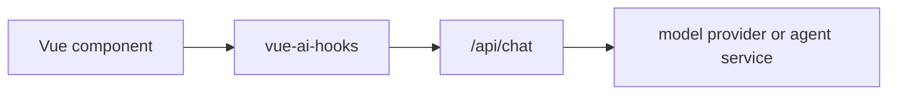

# Inspection

Use inspection state when a chat, completion, embedding, generation, or object
request fails and you need to see what the app actually sent to the provider or
proxy route.

## What is available today

The main composables expose:

| Field          | Use it for                                                                  |
| -------------- | --------------------------------------------------------------------------- |
| `lastRequest`  | The latest sanitized request snapshot, including provider id and metadata.  |
| `lastResponse` | Whether the latest provider/proxy call returned a stream or response shape. |
| `clearTrace()` | Clears request/response trace state without clearing messages or input.     |
| `error`        | The normalized error shown by the current composable.                       |
| `status`       | Lifecycle state: `ready`, `submitted`, `streaming`, or `error`.             |

`useChat` also records AI SDK-style trigger metadata such as
`submit-user-message` and `regenerate-assistant-message`, which helps when
debugging migration code.

## Copyable debug panel

```vue
<script setup lang="ts">
import { computed } from 'vue'
import { useChat } from 'vue-ai-hooks'

const chat = useChat({ api: '/api/chat' })

const traceJson = computed(() =>
  JSON.stringify(
    {
      status: chat.status.value,
      error: chat.error.value?.message ?? null,
      request: chat.lastRequest.value,
      response: chat.lastResponse.value
    },
    null,
    2
  )
)
</script>

<template>
  <form @submit="chat.handleSubmit">
    <textarea v-model="chat.input.value" />
    <button type="submit" :disabled="chat.isLoading.value">Send</button>
  </form>

  <details>
    <summary>Request trace</summary>
    <button type="button" @click="chat.clearTrace()">Clear trace</button>
    <pre>{{ traceJson }}</pre>
  </details>
</template>
```

Do not render provider API keys, raw authorization headers, or full tenant data
in a browser debug panel. If your backend adds those fields, keep them out of
the response and logs you show to users.

## Debugging checklist

1. Confirm `lastRequest.providerId` matches the provider or proxy route you
   expected.
2. Check `lastRequest.messages` to verify message order and tool result
   placement.
3. Check `lastRequest.headers` and `lastRequest.body` for app-owned metadata,
   not provider secrets.
4. Confirm `lastResponse.hasStream` is `true` for streaming chat routes.
5. If `status` reaches `error`, show `error.message` and keep the input so the
   user can retry.
6. If a stream starts but stops midway, check `onFinish` and `isDisconnect`
   before retrying automatically.

## Production path

For production browser apps, send model requests through your own backend or
edge route:



The backend should own provider credentials, rate limits, tenant policy, and
provider-specific observability. `vue-ai-hooks` should own the UI request
lifecycle and the sanitized trace that helps users and support engineers
understand what happened.
