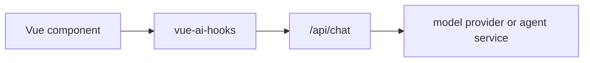

# Inspection

Use inspection state when a chat, completion, embedding, generation, or object
request fails and you need to see what the app actually sent to the provider or
proxy route.

## What is available today

The main composables expose:

| Field          | Use it for                                                                  |
| -------------- | --------------------------------------------------------------------------- |
| `lastRequest`  | The latest request trace, including provider id and app-owned metadata.     |
| `lastResponse` | Whether the latest provider/proxy call returned a stream or response shape. |
| `clearTrace()` | Clears request/response trace state without clearing messages or input.     |
| `error`        | The normalized error shown by the current composable.                       |
| `status`       | Lifecycle state: `ready`, `submitted`, `streaming`, or `error`.             |

`useChat` also records AI SDK-style trigger metadata such as
`submit-user-message` and `regenerate-assistant-message`, which helps when
debugging migration code.

`useChat` also exposes `inspect()` which returns a consolidated snapshot with:

- `request`, `response`, and rendered `status`
- `timeline` for request/response/stream/retry/error events
- normalized `retries` and categorized `error` summary
- compact `providerTrace`
- redacted request/response metadata and `curl` command when `curl` generation
  is enabled

## Copyable debug panel

```vue
<script setup lang="ts">
import { computed, ref } from 'vue'
import { useChat } from 'vue-ai-hooks'
const chat = useChat({
  api: '/api/chat',
  maxRetries: 2
})

const inspection = computed(() => chat.inspect())
const copyStatus = ref('Copy')

async function copyCurl() {
  const curl = inspection.value.curl
  if (!curl) return
  await navigator.clipboard.writeText(curl)
  copyStatus.value = 'Copied'
  window.setTimeout(() => {
    copyStatus.value = 'Copy'
  }, 700)
}

const inspectionJson = computed(() => JSON.stringify(inspection.value, null, 2))
</script>

<template>
  <form @submit="chat.handleSubmit">
    <textarea v-model="chat.input.value" />
    <button type="submit" :disabled="chat.isLoading.value">Send</button>
  </form>

  <details>
    <summary>Request trace</summary>
    <button type="button" @click="chat.clearTrace()">Clear trace</button>
    <button type="button" :disabled="!inspection.curl" @click="copyCurl()">
      {{ copyStatus }}
    </button>
    <p>{{ inspection.summary }}</p>
    <div v-if="inspection.timeline.length">
      <strong>Timeline</strong>
      <ul>
        <li v-for="event in inspection.timeline" :key="`${event.kind}-${event.timestamp}`">
          {{ event.kind }} - {{ event.label || event.message || inspection.summary }}
        </li>
      </ul>
    </div>
    <pre>{{ inspectionJson }}</pre>
  </details>
</template>
```

`inspectRequestTrace()` classifies errors as `authentication`, `rate-limit`,
`network`, `provider`, `validation`, and other render-safe categories. It only
reports `hasCause`; it does not copy raw provider response bodies into the
summary.

The same snapshot already includes a `timeline`, normalized `retries`, a compact
`providerTrace`, and a redacted `curl` command when `curl: true` is set by
`inspect()`.
`createInspectionCurl(request)` is exported separately when you only need the
copyable request command.

## Support bundle

For production support, copy a small redacted bundle instead of dumping raw app
state. This keeps the report useful while avoiding provider keys and tenant
payloads:

```ts
import type { RequestInspectionSnapshot } from 'vue-ai-hooks'

function createSupportBundle(
  label: string,
  hook: { inspect: () => RequestInspectionSnapshot<unknown, unknown> }
) {
  const inspection = hook.inspect()
  return {
    label,
    generatedAt: new Date().toISOString(),
    summary: inspection.summary,
    status: inspection.status,
    error: inspection.error,
    providerTrace: inspection.providerTrace,
    timeline: inspection.timeline,
    retries: inspection.retries,
    curl: inspection.curl
  }
}

const bundle = createSupportBundle('checkout-chat', chat)
await navigator.clipboard.writeText(JSON.stringify(bundle, null, 2))
```

Use the bundle when triaging provider failures, proxy CORS mistakes, timeout
budgets, or bad request bodies. If your app needs tenant identifiers in support
tickets, add a short app-owned id such as `tenantHash` or `traceId`; do not add
full user records, authorization headers, or raw message archives.

Inspection redaction covers sensitive headers plus common credential fields such
as `apiKey`, `accessToken`, `clientSecret`, `password`, `privateKey`, and
`sessionToken` inside request bodies and event metadata. Non-sensitive metadata
stays visible, and the original request objects are not mutated.

Use the redacted `inspection.request`, `inspection.response`, and
`inspection.timeline` values for support panels. Treat `lastRequest` and
`lastResponse` as internal trace refs that may still contain app-owned metadata
before the inspection redaction pass.

When `useChat({ persist })` receives `onLoadError`, `onError`, or
`onClearError` from the persistence layer, `inspect().timeline` records
`persistence load failed`, `persistence save failed`, or
`persistence clear failed` events with `{ phase, key }` metadata. These events
do not include stored message payloads, provider credentials, or raw causes.

Do not render provider API keys, raw authorization headers, or full tenant data
in a browser debug panel. If your backend adds those fields, keep them out of
the response and logs you show to users.

## Debugging checklist

1. Confirm `lastRequest.providerId` matches the provider or proxy route you
   expected.
2. Check `lastRequest.messages` to verify message order and tool result
   placement.
3. Check `inspection.request.headers` and `inspection.request.body` for
   app-owned metadata, not provider secrets.
4. Confirm `lastResponse.hasStream` is `true` for streaming chat routes.
5. If `status` reaches `error`, show `error.message` and keep the input so the
   user can retry.
6. If a stream starts but stops midway, check `onFinish` and `isDisconnect`
   before retrying automatically.
7. Use `inspection.timeline` to correlate request, retry, stream, response, and
   error events before opening a provider support ticket.
8. If local history disappears or cannot be cleared, check persistence events
   in the same timeline before asking users to reset storage.

## Production path

For production browser apps, send model requests through your own backend or
edge route:



The backend should own provider credentials, rate limits, tenant policy, and
provider-specific observability. `vue-ai-hooks` should own the UI request
lifecycle and the sanitized trace that helps users and support engineers
understand what happened.
