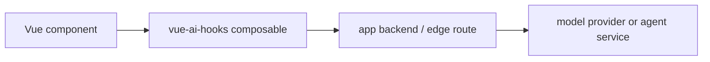

# 选择 vue-ai-hooks

当你需要判断 `vue-ai-hooks` 是否适合某个 Vue AI 功能时，可以先看本页。这里比较的是产品适配度，不是给库排名。

## 简短结论

当你需要这些能力时，选择 `vue-ai-hooks`：

- 以 Vue 3 refs 和 composables 作为主要 API。
- 一个包里覆盖流式聊天、补全、embedding、文档重排、图片生成/编辑、视频生成、语音生成、音频转写、结构化对象和自定义生成任务。
- 生产浏览器应用默认走自有 proxy 路由，避免暴露上游 key。
- 本地 demo、原型或受限 key 场景可以直连 Provider helper。
- 不引入完整 agent 框架，也能获得工具调用、工具审批、stream data、重试、持久化和请求检查。

如果你需要覆盖更广的全栈 AI SDK、纯服务端 Provider SDK、开箱 copilot 外壳，或多 agent
编排框架，可以选择其他层。

## 当前定位图

快照日期：2026-07-03。这里是产品适配图，不是永久基准，也不是把每一行都定义为竞品。
AI SDK UI 是直接替代；CopilotKit 是面向 agent UX 的产品相邻标杆，不是要照搬的 API
形态。LangChain.js 和 VueUse 是集成边界或 DX 标杆。

| 关系                      | 替代方案                                                                     | 需要跟踪的官方范围                                                                                             | `vue-ai-hooks` 的位置                                                                                                                                            |
| ------------------------- | ---------------------------------------------------------------------------- | -------------------------------------------------------------------------------------------------------------- | ---------------------------------------------------------------------------------------------------------------------------------------------------------------- |
| 直接替代                  | [AI SDK UI](https://ai-sdk.dev/docs/reference/ai-sdk-ui)                     | 框架集成、`useChat`、transport、UI message streams、模型 adapter，以及更大的 AI SDK Core 能力面。              | 当 Vue 应用需要一个小型 composable 层，同时覆盖补全、embedding、图片、视频、语音、转写、重排、结构化输出、自有 proxy 路由和无 key demo 时，使用 `vue-ai-hooks`。 |
| 产品相邻标杆              | [CopilotKit](https://docs.copilotkit.ai/reference)                           | 开箱 copilot UI 组件、包含 Vue 的框架 SDK、agent 访问、human-in-the-loop hooks，以及 AG-UI 风格 agent events。 | 只跟踪能保持无 UI、可嵌入的 agent UX 模式。当你需要接入 agent 协议的高层 copilot 外壳时，选择 CopilotKit。                                                       |
| 后端互补层，不是 UI 竞品  | [LangChain.js](https://docs.langchain.com/oss/javascript/langchain/overview) | Agent harness、工具、middleware、retrieval、memory、多 agent 流程和 LangSmith 可观测性。                       | 编排放在 API 路由背后的 LangChain；Vue 中的流式渲染和控制交给 `vue-ai-hooks`。                                                                                   |
| Vue DX 标杆，不是 AI 竞品 | [VueUse](https://vueuse.org/)                                                | 通用 Vue 组合式工具、可 tree-shaking helper、add-on 和交互式工具 demo。                                        | 通用响应式/浏览器工具用 VueUse；AI 请求生命周期、Provider/proxy 契约和模型流状态用 `vue-ai-hooks`。                                                              |

## 一次上手决策矩阵

如果你需要在一周内快速定稿，用这个矩阵先做决策，再查详细文档：

| 一周内要落地的任务                                   | `vue-ai-hooks` | AI SDK UI   | CopilotKit        | LangChain.js |
| ---------------------------------------------------- | -------------- | ----------- | ----------------- | ------------ |
| 搭建 Vue 为中心的 composable 层和定制 UI             | ✅ 最匹配      | ✅ 可用     | ⚪ 偏外壳         | ⚪ 后端层    |
| 先跑一个无 key 的内部 Demo（工具审批/流式/重试）     | ✅ 最匹配      | ✅ 可用     | ⚪ 偏外壳         | ⚪ 无 UI     |
| 浏览器端强制走自有 proxy 路由                        | ✅ 最匹配      | ✅ 可用     | ✅ 可用           | ⚪ 无 UI     |
| 一周内补齐 thread 侧边栏（归档、恢复、侧边列表）     | ✅ 最匹配      | ⚪ 需适配   | ⚪ 无内置         | ⚪ 非 UI 层  |
| 接入应用级 agent runtime 状态，不买完整 copilot 外壳 | ✅ 最匹配      | ⚪ 局部可用 | ✅ 有完整协议支撑 | ⚪ 非 UI 层  |

## 决策表

| 你的任务是                                         | 从这里开始                                |
| -------------------------------------------------- | ----------------------------------------- |
| 构建 Vue 流式聊天 UI                               | `useChat`                                 |
| 调用自己的后端或边缘路由                           | 默认 proxy transport 或 `proxyProvider`   |
| 通过自有后端生成或编辑图片                         | `useImage`                                |
| 通过自有后端生成视频                               | `useVideo`                                |
| 通过自有后端生成语音                               | `useSpeech`                               |
| 通过自有后端转写音频                               | `useTranscription`                        |
| 通过自有后端重排搜索结果                           | `useRerank`                               |
| 迁移已有 AI SDK UI 界面                            | [AI SDK 迁移](/zh/guide/ai-sdk-migration) |
| 在流开始前做 Provider failover                     | `fallbackProvider`                        |
| 不配置 Provider key，先跑本地工具审批 UX           | `examples/chat`                           |
| 构建强产品定制的 AI UI，不接入成品外壳             | `vue-ai-hooks` composables + 自有组件     |
| 快速放入接入 agent 协议的完整 copilot 面板         | CopilotKit 风格 UI 框架                   |
| 构建 agent graph、retriever 或长时间运行的计划流程 | 在模型后面使用 workflow 或 agent 框架     |
| 和 React-first AI SDK UI 应用共享大量代码          | AI SDK UI 可能更适合作为主层              |

## 按类别看适配

### Vercel AI SDK

[AI SDK](https://ai-sdk.dev/docs) 是覆盖面很广的全栈 SDK，提供 UI message stream
协议、transport、模型 adapter、工具调用和框架集成。它的官方 UI 文档已经包含 Vue
支持，但 framework support matrix 里 React 仍是最完整的 UI surface，Vue package
主要围绕 chat。

`vue-ai-hooks` 更窄：它专注 Vue composables、自有 proxy 路由、Provider adapter 和类型化
refs。它接受 AI SDK 风格概念，例如 `transport`、`messages`、`sendMessage()`、
`addToolOutput()`、`addToolApprovalResponse()`、`stopWhen`、`experimental_throttle`
和 UI message stream parts，方便团队逐步迁移。

如果你的主应用已经走 AI SDK 支持的框架路径，或希望它的全栈模型生态作为中心，可以选择 AI
SDK。如果你的中心是 Vue 状态和小 API 面，选择 `vue-ai-hooks`。

### LangChain.js

[LangChain.js](https://docs.langchain.com/oss/javascript/langchain/overview) 适合 chain、agent、
retriever、memory、模型抽象和工具编排。

`vue-ai-hooks` 不是 agent 框架，所以 LangChain 是集成目标，不是正面对打的 UI 竞品。它负责浏览器/应用
composable 层：渲染流、请求生命周期、Provider/proxy transport、本地工具审批和 UI 诊断。
需要编排时，可以在 API 路由背后使用 LangChain 或类似后端框架，然后把 `ChatChunk` 或 AI
SDK UI stream parts 返回给 `vue-ai-hooks`。

### CopilotKit

[CopilotKit](https://docs.copilotkit.ai/reference) 是产品相邻标杆，不是直接 API
竞品。它的 reference docs 包含框架 SDK、Vue composables 和 components、chat UI
components、前端工具、human-in-the-loop hooks 和 agent 访问能力。它的 AG-UI
文档描述了用 event-based SSE 把前端连接到 agent 的协议。

`vue-ai-hooks` 刻意保持更底层。它不提供完整的开箱即用 copilot 外壳，但支持可复用的无 UI
Vue 原语（例如 task-starter、Thread 侧边栏状态和应用级人工审核状态）。如果你想要即插即用
copilot UI 并直接接入 agent protocol，CopilotKit 可能是更快起点。

### 手写 fetch 和 SSE 解析

手写 `fetch` 加 SSE 解析可以撑住一个 demo。等你需要 abort、重试、状态、stream
throttling、工具调用、usage、metadata、fallback、持久化、结构化对象输出和测试 fake 时，维护成本会快速上升。

`vue-ai-hooks` 把这些关注点收进一个可复用 Vue 层，同时仍然允许你完全拥有后端协议。

### VueUse

[VueUse](https://vueuse.org/) 是通用 Vue 工具集合。它可以和本库互补，但不提供 LLM
Provider adapter、AI stream 解析、工具调用或模型请求序列化。

通用浏览器和响应式工具用 VueUse；AI 请求生命周期用 `vue-ai-hooks`。

## 架构适配

推荐的生产路径：



这样 Provider 凭据留在服务端，应用后端负责限流、租户策略、日志和 Provider 专属重试。

直连 Provider 适合本地 demo、内部工具和受限 key：

```ts
const chat = useChat({
  provider: deepseek({
    apiKey: import.meta.env.VITE_DEEPSEEK_API_KEY,
    timeoutMs: 30_000
  })
})
```

## 本包刻意不负责什么

- Provider 账单、配额策略和限流。
- 会执行高权限动作的工具沙箱。
- 长时间运行的 agent planning 或 retrieval pipeline。
- 服务端密钥存储。
- 厂商专属可观测性后端。

这些应该放在你的应用后端或 agent 服务里。`vue-ai-hooks` 给 Vue 界面提供调用它们的稳定契约。
