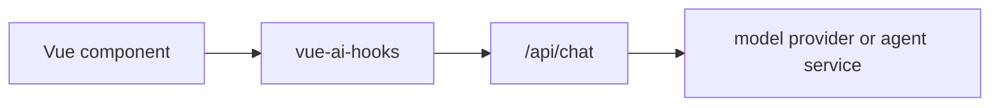

# 调试检查

当聊天、补全、embedding、生成或结构化对象请求失败时，先用检查状态确认应用实际发给了
Provider 或 proxy 路由什么内容。

## 当前可用能力

主要组合式函数会暴露：

| 字段           | 用途                                                         |
| -------------- | ------------------------------------------------------------ |
| `lastRequest`  | 最新一次经过清洗的请求快照，包含 provider id 和 metadata。   |
| `lastResponse` | 最新 provider/proxy 调用是否返回 stream 或响应结构。         |
| `clearTrace()` | 只清空 request/response trace，不清空消息和输入。            |
| `error`        | 当前组合式函数归一化后的错误。                               |
| `status`       | 生命周期状态：`ready`、`submitted`、`streaming` 或 `error`。 |

`useChat` 还会记录 AI SDK 风格的 trigger metadata，例如
`submit-user-message` 和 `regenerate-assistant-message`，方便排查迁移代码。

## 可复制的调试面板

```vue
<script setup lang="ts">
import { computed } from 'vue'
import { useChat } from 'vue-ai-hooks'

const chat = useChat({ api: '/api/chat' })

const traceJson = computed(() =>
  JSON.stringify(
    {
      status: chat.status.value,
      error: chat.error.value?.message ?? null,
      request: chat.lastRequest.value,
      response: chat.lastResponse.value
    },
    null,
    2
  )
)
</script>

<template>
  <form @submit="chat.handleSubmit">
    <textarea v-model="chat.input.value" />
    <button type="submit" :disabled="chat.isLoading.value">发送</button>
  </form>

  <details>
    <summary>请求 trace</summary>
    <button type="button" @click="chat.clearTrace()">清空 trace</button>
    <pre>{{ traceJson }}</pre>
  </details>
</template>
```

不要在浏览器调试面板里渲染 Provider API key、原始 authorization header 或完整租户数据。
如果后端会补这些字段，不要把它们返回给浏览器，也不要显示在用户可见日志里。

## 排查清单

1. 确认 `lastRequest.providerId` 是预期的 Provider 或 proxy 路由。
2. 检查 `lastRequest.messages`，确认消息顺序和 tool result 位置正确。
3. 检查 `lastRequest.headers` 和 `lastRequest.body` 里的应用 metadata，不要暴露
   Provider secret。
4. 流式聊天路由应确认 `lastResponse.hasStream` 为 `true`。
5. 如果 `status` 进入 `error`，展示 `error.message`，并保留输入便于用户重试。
6. 如果 stream 已开始但中途停止，先检查 `onFinish` 和 `isDisconnect`，再决定是否自动重试。

## 生产路径

生产浏览器应用应通过自己的后端或边缘路由发送模型请求：



后端负责 Provider 凭据、限流、租户策略和 Provider 专属可观测性。
`vue-ai-hooks` 负责 UI 请求生命周期，以及帮助用户和支持人员理解问题的安全 trace。
