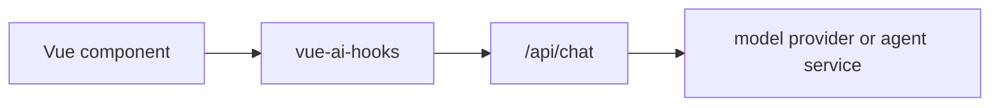

# 调试检查

当聊天、补全、embedding、生成或结构化对象请求失败时，先用检查状态确认应用实际发给了
Provider 或 proxy 路由什么内容。

## 当前可用能力

主要组合式函数会暴露：

| 字段           | 用途                                                         |
| -------------- | ------------------------------------------------------------ |
| `lastRequest`  | 最新一次请求 trace，包含 provider id 和应用自有 metadata。   |
| `lastResponse` | 最新 provider/proxy 调用是否返回 stream 或响应结构。         |
| `clearTrace()` | 只清空 request/response trace，不清空消息和输入。            |
| `error`        | 当前组合式函数归一化后的错误。                               |
| `status`       | 生命周期状态：`ready`、`submitted`、`streaming` 或 `error`。 |

`useChat` 还会记录 AI SDK 风格的 trigger metadata，例如
`submit-user-message` 和 `regenerate-assistant-message`，方便排查迁移代码。

## 可复制的调试面板

```vue
<script setup lang="ts">
import { computed, ref } from 'vue'
import {
  inspectRequestTrace,
  useChat,
  type InspectionRetryRecordInput,
  type InspectionTimelineEventInput
} from 'vue-ai-hooks'

const retries = ref<InspectionRetryRecordInput[]>([])
const streamEvents = ref<InspectionTimelineEventInput[]>([])
const chat = useChat({
  api: '/api/chat',
  onRetry(error, context) {
    retries.value.push({
      attempt: context.attempt,
      maxRetries: context.maxRetries,
      error,
      timestamp: Date.now()
    })
  },
  onChunk(chunk) {
    streamEvents.value.push({
      kind: 'stream',
      label: 'stream chunk',
      timestamp: Date.now(),
      metadata: { type: chunk.type }
    })
  }
})

const inspection = computed(() =>
  inspectRequestTrace({
    status: chat.status.value,
    error: chat.error.value,
    lastRequest: chat.lastRequest.value,
    lastResponse: chat.lastResponse.value,
    retries: retries.value,
    events: streamEvents.value,
    curl: true
  })
)

const inspectionJson = computed(() => JSON.stringify(inspection.value, null, 2))
</script>

<template>
  <form @submit="chat.handleSubmit">
    <textarea v-model="chat.input.value" />
    <button type="submit" :disabled="chat.isLoading.value">发送</button>
  </form>

  <details>
    <summary>请求 trace</summary>
    <button type="button" @click="chat.clearTrace()">清空 trace</button>
    <p>{{ inspection.summary }}</p>
    <pre>{{ inspectionJson }}</pre>
  </details>
</template>
```

`inspectRequestTrace()` 会把错误分类为 `authentication`、`rate-limit`、`network`、
`provider`、`validation` 等适合界面渲染的类别。它只报告 `hasCause`，不会把原始
Provider 响应体复制进 summary。

同一个 snapshot 现在还包含 `timeline`、归一化后的 `retries`、紧凑的
`providerTrace`，以及设置 `curl: true` 后生成的脱敏 `curl` 命令。只需要复制请求命令时，
也可以单独调用导出的 `createInspectionCurl(request)`。

调试脱敏会覆盖敏感 header，以及请求 body 和事件 metadata 里的 `apiKey`、`accessToken`、
`clientSecret`、`password`、`privateKey`、`sessionToken` 等常见凭据字段。非敏感 metadata
仍会保留，原始请求对象不会被修改。

支持面板应使用脱敏后的 `inspection.request`、`inspection.response` 和
`inspection.timeline`。`lastRequest` 和 `lastResponse` 是内部 trace ref，经过调试脱敏前可能仍包含
应用自有 metadata。

当 `useChat({ persist })` 从持久化层收到 `onLoadError`、`onError` 或
`onClearError` 时，`inspect().timeline` 会记录 `persistence load failed`、
`persistence save failed` 或 `persistence clear failed` 事件，并附带
`{ phase, key }` metadata。这些事件不会包含已保存的消息 payload、Provider 凭据或原始
cause。

不要在浏览器调试面板里渲染 Provider API key、原始 authorization header 或完整租户数据。
如果后端会补这些字段，不要把它们返回给浏览器，也不要显示在用户可见日志里。

## 排查清单

1. 确认 `lastRequest.providerId` 是预期的 Provider 或 proxy 路由。
2. 检查 `lastRequest.messages`，确认消息顺序和 tool result 位置正确。
3. 检查 `inspection.request.headers` 和 `inspection.request.body` 里的应用 metadata，不要暴露
   Provider secret。
4. 流式聊天路由应确认 `lastResponse.hasStream` 为 `true`。
5. 如果 `status` 进入 `error`，展示 `error.message`，并保留输入便于用户重试。
6. 如果 stream 已开始但中途停止，先检查 `onFinish` 和 `isDisconnect`，再决定是否自动重试。
7. 用 `inspection.timeline` 串起 request、retry、stream、response 和 error，再决定是否需要找
   Provider 支持排查。
8. 如果本地历史消失或无法清理，先在同一个 timeline 里检查 persistence 事件，再让用户重置
   storage。

## 生产路径

生产浏览器应用应通过自己的后端或边缘路由发送模型请求：



后端负责 Provider 凭据、限流、租户策略和 Provider 专属可观测性。
`vue-ai-hooks` 负责 UI 请求生命周期，以及帮助用户和支持人员理解问题的安全 trace。
